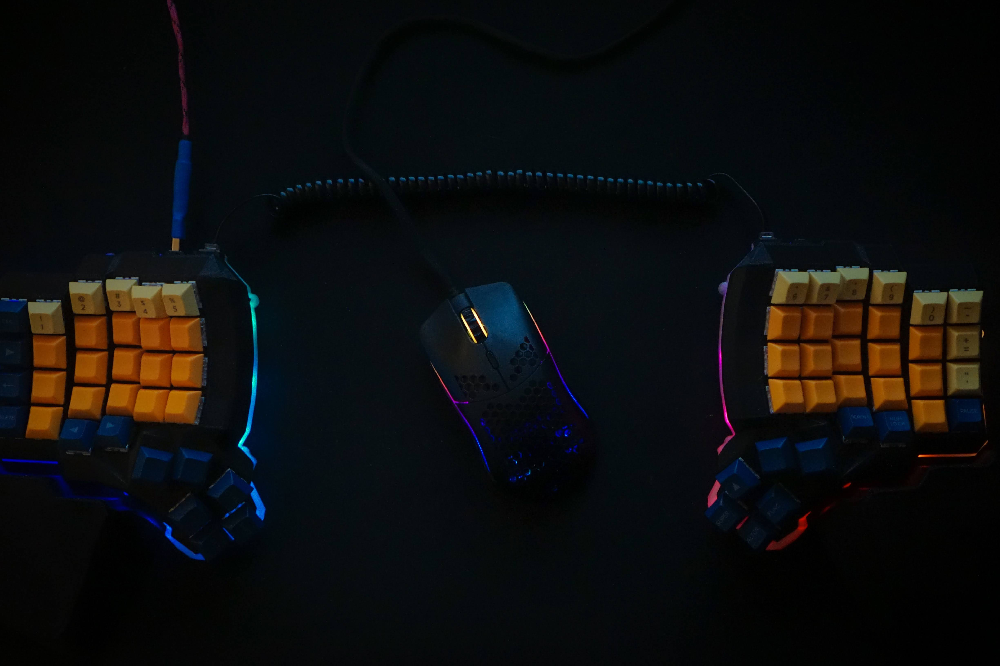
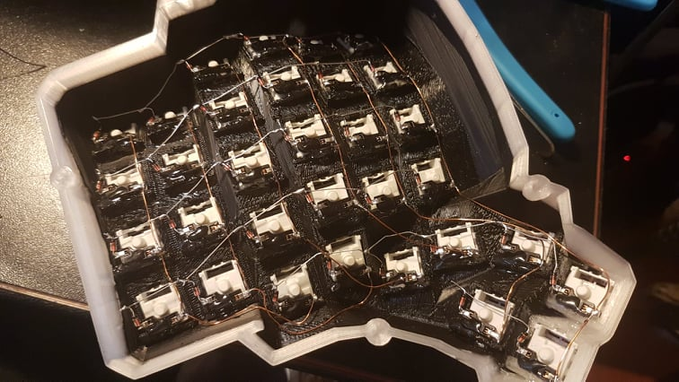
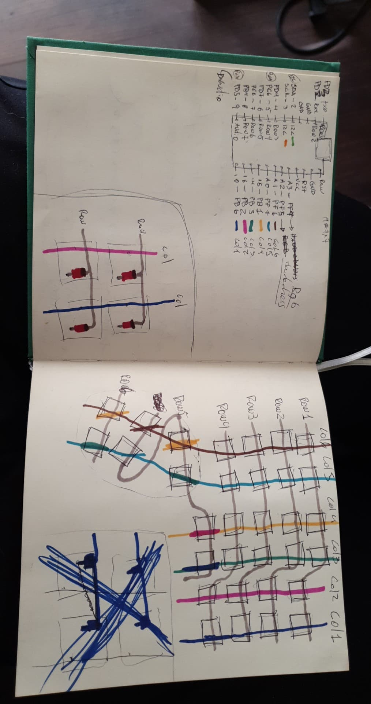
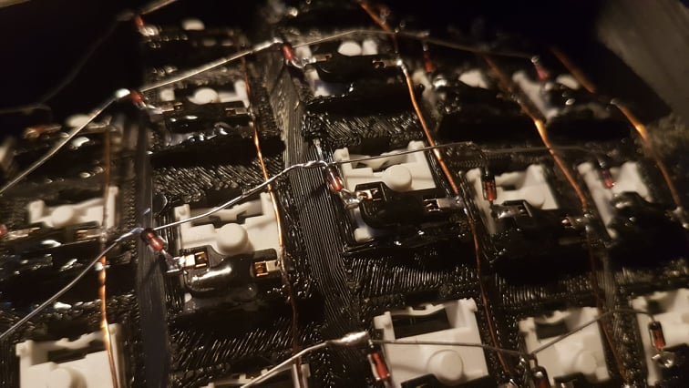

# My Dactyl-ManuForm Keyboard

This is a fork of the [Dactyl](https://github.com/adereth/dactyl-keyboard), a parameterized, split-hand, concave, columnar, ergonomic keyboard.
I've applied a couple fixes to the geometry and also:

- added kailh switch support and kailh hot swap socket cradles for every switch.
- added 3d printable wrist rests
- added 3d printable bottom plates

you can find ready to print files on the [things directory](https://github.com/burabure/dactyl-keyboard/blob/master/things/)

## Assembly

### Printing

Pregenerated STL files are available in the [things/](things/) directory.

This model can be tricky to print, but I printed @ home with my cheap ender 3 printer (calibration is key).
If printed at Shapeways or other professional shops, I would not expect any problems.

I reccomend that you print a couple [switch holes](things/switch-hole.stl) to test your switches fit before printing the whole keyboard.
The fit should be thight and the switch hole should flex a little, but not deform. if the fit is not right, you'll have to change the `keyswitch-height` and `keyswitch-width` and regenerate the desings (see [Generating a Design](#generating-a-design))

### Materials

Here are materials I used for the build:

- 2 x [Pro Micro ATmega32U4 5V/16MHz](https://www.amazon.com/gp/product/B01HCXMBOU/ref=ppx_yo_dt_b_asin_title_o05_s00?ie=UTF8&psc=1)
- [30 AWG Magnet Wire](https://www.amazon.com/BNTECHGO-AWG-Magnet-Wire-Transformers/dp/B07GBMKMKY/ref=sr_1_13?dchild=1&keywords=30+awg+wire&qid=1593643486&sr=8-13)
- [30 Gauge Stranded Wire](https://www.amazon.com/BNTECHGO-Silicone-Flexible-Resistant-Insulation/dp/B01M70EDCW/ref=sr_1_14?dchild=1&keywords=30+awg+wire&qid=1593643486&sr=8-14)
- [1N4148 Switching Diode 100V 200mA Hole DO-35](https://www.amazon.com/McIgIcM-1n4148-switching-Standard-Through/dp/B06XB1R2NK/ref=sr_1_3?dchild=1&keywords=1N4148+diodes&qid=1593644189&sr=8-3)
- [M3 x 3 mm Female Thread Brass Knurled Threaded Insert](https://www.amazon.com/gp/product/B01IYWTCWW/ref=ppx_yo_dt_b_asin_title_o02_s00?ie=UTF8&psc=1)
- [M3x4.8mm Flat Phillips Head Screw](https://www.amazon.com/uxcell-Computer-M3x4-8mm-Phillips-200pcs/dp/B01N3ZG5OM/ref=sr_1_3?dchild=1&keywords=M3+screws+5mm&qid=1593643935&sr=8-3)
- [4P4C Female Telephone Connector](https://www.amazon.com/gp/product/B07S48FL5H/ref=ppx_yo_dt_b_asin_title_o02_s00?ie=UTF8&psc=1)
- [Phone Reciever RJ9 Coiled Cable](https://www.amazon.com/gp/product/B07CJ8SVB4/ref=ppx_yo_dt_b_asin_title_o02_s00?ie=UTF8&psc=1)
- [USB 2.0 A-Male to Micro B](https://www.amazon.com/gp/product/B0719H12WD/ref=ppx_yo_dt_b_asin_title_o02_s00?ie=UTF8&psc=1)
- [Straight Solder Type A USB Female Jack Connector](https://www.amazon.com/gp/product/B0094DXENY/ref=ppx_yo_dt_b_asin_title_o01_s00?ie=UTF8&psc=1)
<<<<<<< HEAD
- [1U Blank DSA Keycaps](https://www.amazon.com/-/es/gp/product/B07VT7JP8Q/ref=ppx_yo_dt_b_asin_title_o04_s00?currency=USD&ie=UTF8&language=en_US&psc=1)
- [2 4.5K Ohm Resistors](https://www.amazon.com/gp/product/B07QJB3LGN/ref=ppx_yo_dt_b_asin_title_o07_s00?ie=UTF8&psc=1)
- Switches (64, but you should get more just in case), I used [Hako Violet](https://kbdfans.com/products/hako-violet-mechanical-switches)
=======
- Switches (64, but you should get more just in case), I used [Hako Violet]()
>>>>>>> 39591f1... flesh out docs as a step by step tutorial
- If you want hot swappable switches [Kailh PCB Socket](https://kbdfans.com/products/mechanical-keyboard-switches-kailh-pcb-socket)
- if you want RGB [WS2812B Individually Addressable LED Strip Light](https://www.amazon.com/gp/product/B00ZHB9M6A/ref=ppx_yo_dt_b_asin_title_o03_s00?ie=UTF8&psc=1)
- optional, see below [USB 2.0 A Male to A Male](https://www.amazon.com/Monoprice-Transfer-Enclosures-Printers-Cameras/dp/B002KKXP3M/ref=sr_1_7?dchild=1&keywords=usb+a+to+usb+a&qid=1593642770&sr=8-7)

#### Handmade USB cable

To be honest the comercially available USB 2.0 A MALE to A Male cables are trash. I decided to make my own with these materials.
 The process is as simple as solder wires to one male usb connector, wrap connections in heat shrink, wrap in paracord, use heatshrink to hold paracord and connector, repeat for the other side. just make sure you're wiring the connectors correctly.
- [Soldering USB Type A Male Connector w Metal Shell](https://www.amazon.com/gp/product/B012T99HI0/ref=ppx_yo_dt_b_asin_title_o01_s00?ie=UTF8&psc=1)
- [Paracord](https://www.amazon.com/gp/product/B01N6EDEIJ/ref=ppx_yo_dt_b_asin_title_o01_s00?ie=UTF8&psc=1)
- [Heat Shrink Tube](https://www.amazon.com/gp/product/B01MFA3OFA/ref=ppx_yo_dt_b_asin_title_o01_s00?ie=UTF8&psc=1)
- [30 Gauge Stranded Wire](https://www.amazon.com/BNTECHGO-Silicone-Flexible-Resistant-Insulation/dp/B01M70EDCW/ref=sr_1_14?dchild=1&keywords=30+awg+wire&qid=1593643486&sr=8-14)

## Step by step

### 1. Put all the switches in the key slots

Required parts:

* 64 switches
* The dactyl cases

Simplest, and yet the most rewarding step, put on the switches in the key slots,
it is important to note that the little ledge has to be in-between the switch's
legs

Once you're done with all of them it should look beautiful like so:

### 2. (Optional) Put the PCB socket in all of the switches

Required parts:

* 64 PCB sockets
* The dactyl cases
* Super glue (or any kind of strong plastic glue)

If you opted to have swappable switches, now is the moment to put them, because
the soldering part comes right after this, that means that if you decided to have
swappable switches later on, then it is going to be a big pain to put them on.

With that little word of advice out of the way, it is time to proceed to put the PCB on
the a single switch, as the image shows:

TODO: switch + PCB socket

Once you confirm that everything fits perfectly, you can proceed to add a bit
of glue right in the middle of the PCB socket and press against the ledge of the
key slot, rinse and repeat for all the remaining keys.

TODO: final image

### 3. Wiring

I wired using the traditional approach of using the legs of a diode to form the row connections, and then using magnet wire to connect the columns

If you want to use kailh hotswap sockets you'll need to glue'em like so to the tabs:

if you don't want to have hotswappable switches you can just ignore the tabs or tear them off.

Once the switch wiring is done, you'll have to wire everything to the ProMicro with the common stranded wire.
Finally wire the case connectors to the ProMicro, I cut the USB Micro B cable and soldered it to the female USB A case connector to connect it to the ProMicro.

### Firmware

Firmware goes hand in hand with how you wire the circuit.
 If you follow my wiring you can use my qmk firware [here](https://github.com/burabure/qmk_firmware/tree/master/keyboards/dactyl_manuform)

### Generating a Design

**Setting up the Clojure environment**

- [Install the Clojure runtime](https://clojure.org)
- [Install the Leiningen project manager](http://leiningen.org/)
- [Install OpenSCAD](http://www.openscad.org/)

**Generating the design**

- Run `lein repl`
- Load the file `(load-file "src/dactyl_keyboard/dactyl.clj")`
- This will regenerate the `things/*.scad` files
- Use OpenSCAD to open a `.scad` file.
- Make changes to design, repeat `load-file`, OpenSCAD will watch for changes and rerender.
- When done, use OpenSCAD to export STL files

**Tips**

- [Some other ways to evaluate the clojure design file](http://stackoverflow.com/a/28213489)
- [Example designing with clojure](http://adereth.github.io/blog/2014/04/09/3d-printing-with-clojure/)

## License

Copyright © 2015-2020 Matthew Adereth, Tom Short and Nicolas Fernandez

The source code for generating the models (everything excluding the [things/](things/) and [resources/](resources/) directories is distributed under the [GNU AFFERO GENERAL PUBLIC LICENSE Version 3](LICENSE). The generated models and PCB designs are distributed under the [Creative Commons Attribution-NonCommercial-ShareAlike License Version 3.0](LICENSE-models).
